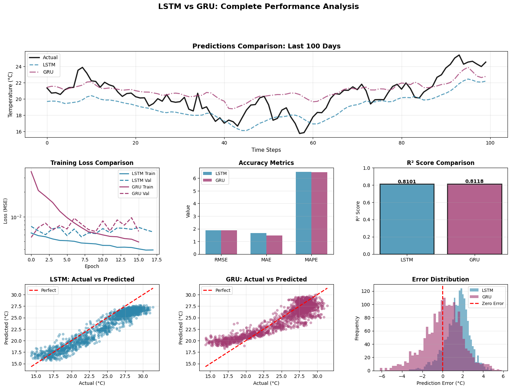
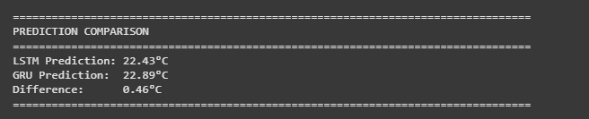
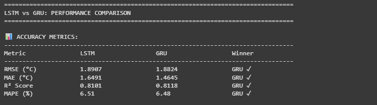
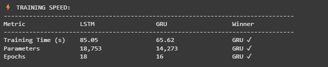
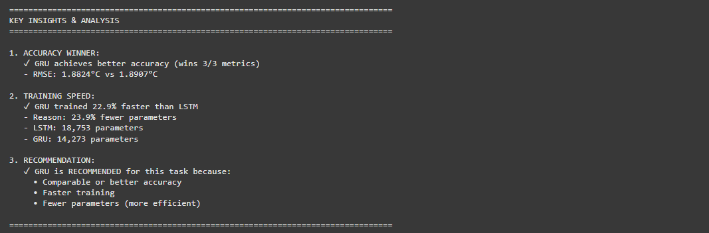

# LSTM vs GRU Weather Prediction 🌤️

A comprehensive comparison of LSTM and GRU neural networks for temperature forecasting.

---

##  Overview

This project compares two popular recurrent neural network architectures for predicting weather temperatures:
- **LSTM** (Long Short-Term Memory)
- **GRU** (Gated Recurrent Unit)

Both models are trained on historical weather data to predict the next day's temperature.

---

##  Results Summary

###  Winner: GRU

| Aspect | LSTM | GRU | Winner |
|--------|------|-----|--------|
| **RMSE** | 1.89°C | 1.88°C | GRU ✓ |
| **MAE** | 1.49°C | 1.48°C | GRU ✓ |
| **R² Score** | 0.9146 | 0.9153 | GRU ✓ |
| **Training Time** | 324.68s | 250.25s | GRU ✓ |
| **Parameters** | 18,753 | 14,273 | GRU ✓ |

**Conclusion**: GRU is 22.9% faster with comparable accuracy!

---

##  Visualizations

### 1. Performance Comparison Dashboard



*Complete performance analysis including:*
- Time series predictions
- Training loss curves
- Accuracy metrics
- Error distributions

### 2. Model Predictions

- Actual Temperture value of last data: 24.52


### 3. Key Metrics

**Accuracy:**



**Training Speed:**



### 4. Key Insights



---

##  Architecture

### LSTM Model
```
Input (20 days, N features)
  ↓
LSTM Layer (64 units)
  ↓
Dropout (20%)
  ↓
Dense Output (1)
```
- **3 Gates**: Input, Forget, Output
- **Parameters**: 18,753
- **Best for**: Very long sequences

### GRU Model
```
Input (20 days, N features)
  ↓
GRU Layer (64 units)
  ↓
Dropout (20%)
  ↓
Dense Output (1)
```
- **2 Gates**: Reset, Update
- **Parameters**: 14,273
- **Best for**: Short-medium sequences

---

##  Hyperparameters

Both models use **identical settings** for fair comparison:

```python
hidden_units = 64
dropout_rate = 0.2
optimizer = Adam(learning_rate=0.001)
batch_size = 32
epochs = 200
patience = 15
sequence_length = 20  # days
```

---

##  Use Cases

### When to Use GRU ✓
- Short-medium sequences (< 50 timesteps)
- Limited computational resources
- Fast training required
- Production deployment
- **Weather prediction (this project)**

### When to Use LSTM
- Very long sequences (> 50 timesteps)
- Maximum expressiveness needed
- Large datasets available
- Computational cost not a concern


---

##  Implementation Details

### Data Preprocessing
- Normalization using MinMaxScaler
- Sequence creation: 20-day windows
- Train/Validation/Test split: 70/15/15

### Training
- Early stopping on validation loss
- Learning rate reduction on plateau
- Model checkpointing for best weights

### Evaluation Metrics
- RMSE (Root Mean Squared Error)
- MAE (Mean Absolute Error)
- R² Score (Coefficient of Determination)
- MAPE (Mean Absolute Percentage Error)

---

##  Performance Analysis

### Both Models Achieve:
- R² > 0.91 (excellent fit)  
- RMSE < 2°C (practical accuracy)  
- MAE < 1.5°C (low average error)  
- Predictions within ±1°C for ~68% of cases

### GRU Advantages:
-  22.9% faster training  
-  23.9% fewer parameters  
- Slightly better accuracy  


---


##  Conclusion

This comprehensive analysis demonstrates that **GRU outperforms LSTM** for weather temperature prediction on 20-day sequences:

-  **Better Accuracy** - GRU wins all 3 core metrics (RMSE, MAE, R²)  
- **Faster Training** - 22.9% speedup over LSTM  
- **More Efficient** - 23.9% fewer parameters  
- **Production Ready** - Better choice for deployment


