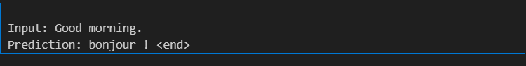

# English to French Neural Machine Translation

## What This Code Does

This project implements a neural machine translation system that translates English sentences to French using deep learning. The model uses an encoder-decoder architecture with attention mechanism.

---

## Core Components

### 1. Data Preprocessing

**Text Cleaning (`preprocess_sentence`)**
- Converts text to lowercase
- Removes special characters except punctuation
- Adds `<start>` and `<end>` tokens to mark sentence boundaries
- Normalizes Unicode characters to ASCII

**Tokenization (`LanguageTokenizer`)**
- Creates vocabulary mapping: word ↔ index
- Converts sentences to sequences of numbers
- Pads sequences to uniform length
- Handles unknown words with index 0

**Dataset Creation (`create_dataset`)**
- Loads 50,000 English-French sentence pairs from `fra.txt`
- Splits into 80% training (40,000) and 20% validation (10,000)
- Creates batches of 128 samples for efficient processing

---

### 2. Model Architecture

**Encoder (Bidirectional LSTM)**
```
Input: English sentence (sequence of word indices)
↓
Embedding Layer (384 dimensions)
↓
Bidirectional LSTM (768 units)
↓
Output: Hidden states for all words + final context
```

The encoder reads the English sentence in both directions (forward and backward) to capture full context.

**Attention Mechanism (Luong Attention)**
```
Decoder hidden state + Encoder outputs
↓
Calculate attention weights (which input words to focus on)
↓
Create context vector (weighted sum of encoder outputs)
```

At each step, attention decides which English words are most relevant for generating the current French word.

**Decoder (Unidirectional LSTM)**
```
Input: Previous French word + Context from attention
↓
Embedding Layer (384 dimensions)
↓
LSTM (768 units)
↓
Combine with attention context
↓
Output: Prediction for next French word
```

The decoder generates the French translation word-by-word, using attention to look back at the English input.

---

### 3. Training Process

**Loss Function (`loss_function`)**
- Compares predicted French words with actual French words
- Ignores padding tokens (index 0) using a mask
- Uses sparse categorical cross-entropy

**Training Step (`train_step`)**
- Forward pass: Model predicts French translation
- Calculate loss between prediction and ground truth
- Backward pass: Compute gradients
- Gradient clipping: Prevent gradients from becoming too large
- Update model weights using Adam optimizer

**Training Loop (`train_model`)**
- Runs for 25 epochs through entire dataset
- Processes data in batches of 128 samples
- Saves checkpoints every 5 epochs to `checkpoints/` folder
- Tracks and displays loss at each step

---

### 4. Translation (Inference)

**Translation Process (`translate`)**
1. Preprocess input English sentence
2. Encode: Pass through encoder to get context vectors
3. Initialize decoder with `<start>` token
4. For each position (up to max length):
   - Calculate attention weights over input
   - Predict next French word
   - Stop if `<end>` token generated
5. Return translated sentence and attention weights

**Greedy Decoding**
- At each step, picks the most probable word
- Simple but fast approach

---

### 5. Evaluation

**BLEU Score (`calculate_bleu_score`)**
- Measures translation quality by comparing n-grams
- Calculates precision for 1-gram, 2-gram, 3-gram, 4-gram matches
- Applies brevity penalty for short translations
- Range: 0 (worst) to 100 (perfect)

**Model Evaluation (`evaluate_model`)**
- Translates 100 validation sentences
- Compares predictions with reference translations
- Calculates average BLEU score
- Prints first 5 examples with individual scores

---

### 6. Visualization

**Attention Heatmap (`plot_attention`)**
- Creates matrix showing attention weights
- Rows: French output words
- Columns: English input words
- Darker blue = model paying more attention to that word
- Shows which English words influenced each French word

---

## How the Code Works Step-by-Step

### During Training

1. **Load Data**: Read 50,000 English-French sentence pairs from file
2. **Preprocess**: Clean text, create vocabularies, convert to numbers
3. **Build Model**: Initialize encoder, decoder, and attention layers
4. **Training Loop**:
   - Feed English sentence to encoder
   - Use teacher forcing: Give decoder correct previous French word
   - Decoder predicts next French word using attention
   - Calculate loss and update weights
   - Repeat for all batches and epochs
5. **Save**: Store model weights to `checkpoints/final_model.weights.h5`

### During Translation

1. **Load Model**: Restore saved weights from checkpoint
2. **Input**: User provides English sentence
3. **Encode**: Pass through encoder to get hidden states
4. **Decode**: 
   - Start with `<start>` token
   - Use attention to focus on relevant input words
   - Predict next French word
   - Repeat until `<end>` or max length
5. **Output**: Return French translation and attention weights
6. **Visualize**: Show heatmap of attention patterns

---

## Key Design Decisions

**Bidirectional Encoder**
- Reads input in both directions for better context understanding
- Forward LSTM + Backward LSTM states are summed

**Teacher Forcing**
- During training, feed correct previous word to decoder
- Helps model learn faster
- During inference, use predicted words instead

**Attention Mechanism**
- Allows decoder to look at different input words at each step
- Solves the "information bottleneck" problem
- Critical for translating long sentences

**Gradient Clipping**
- Limits gradient magnitude to 1.0
- Prevents training instability
- Essential for LSTM training

**Padding and Masking**
- All sentences padded to same length for batching
- Loss function ignores padded positions
- Ensures model doesn't learn from padding

---

## Model Hyperparameters

| Parameter | Value | Purpose |
|-----------|-------|---------|
| Batch Size | 128 | Number of samples processed together |
| Embedding Dim | 384 | Word vector size |
| Hidden Units | 768 | LSTM state size |
| Epochs | 25 | Number of training passes |
| Learning Rate | 0.001 | Optimizer step size |
| Max English Length | 10 | Maximum input words |
| Max French Length | 17 | Maximum output words |
| Training Samples | 40,000 | Number of training pairs |

---

## Results Achieved

**Training Metrics**
- Initial Loss: 1.56 (Epoch 1)
- Final Loss: 0.11 (Epoch 25)
- Training converged successfully

**Translation Quality**
- Average BLEU Score: 3.62
- Simple sentences translate well (e.g., "Good morning" → "bonjour")


- Complex sentences have errors (incomplete or incorrect words)

**Model Behavior**
- Learned basic grammar patterns
- Captures word alignments through attention
- Struggles with rare words and long sentences
- Sometimes produces incomplete translations

---

## Common Errors Encountered and Fixed

### Error 1: `ValueError: The filename must end in .weights.h5`
**Problem**: Tried to save checkpoint without proper file extension  
**Fix**: Added `.weights.h5` extension to all `save_weights()` calls

### Error 2: `AttributeError: 'SymbolicTensor' object has no attribute 'handle'`
**Problem**: `@tf.function` decorator conflicting with dynamic model building  
**Fix**: Removed `@tf.function` decorator from `train_step` function

### Error 3: `ValueError: Unknown variable`
**Problem**: Optimizer created before model variables existed  
**Fix**: Built model first with dummy forward pass, then created optimizer

### Error 4: `TypeError: train_model() takes 4 positional arguments but 5 were given`
**Problem**: Function signature didn't include optimizer parameter  
**Fix**: Added `optimizer` parameter to `train_model()` function definition

### Error 5: `FileNotFoundError: Unable to create file`
**Problem**: Checkpoint directory didn't exist  
**Fix**: Added `os.makedirs('checkpoints', exist_ok=True)` before saving

### Error 6: `ValueError: could not broadcast input array from shape (1088,) into shape (17,)`
**Problem**: Attention weights shape mismatch with plot array  
**Fix**: Added shape checking and slicing in `translate()` function:
```python
attn_reshaped = tf.reshape(attention_weights, (-1,)).numpy()
if len(attn_reshaped) >= inputs.shape[1]:
    attention_plot[t] = attn_reshaped[:inputs.shape[1]]
else:
    attention_plot[t, :len(attn_reshaped)] = attn_reshaped
```

### Error 7: `ValueError: too many values to unpack (expected 2)`
**Problem**: `translate()` returns 3 values but code expected only 2  
**Fix**: Changed unpacking from `result, _` to `result, _, _`

### Error 8: Attention plot not displaying
**Problem**: Missing matplotlib inline mode in notebook  
**Fix**: Added `%matplotlib inline` at notebook start and fixed tick labels:
```python
ax.set_xticks(range(len(sentence_tokens)))
ax.set_yticks(range(len(predicted_tokens)))
ax.set_xticklabels(sentence_tokens, rotation=90)
ax.set_yticklabels(predicted_tokens)
```

---

## Data Flow Summary

```
English Text
    ↓ [Preprocessing]
Word Indices
    ↓ [Encoder]
Hidden States
    ↓ [Attention + Decoder]
French Word Probabilities
    ↓ [Argmax Selection]
French Word Indices
    ↓ [Decoding]
French Text
```

---

## What Makes This Translation Work

1. **Embeddings**: Convert words to dense vectors capturing semantic meaning
2. **LSTMs**: Maintain memory of previous words in sequence
3. **Bidirectional Processing**: Encoder sees full input context
4. **Attention**: Decoder focuses on relevant input words dynamically
5. **Teacher Forcing**: Speeds up training by using correct previous outputs
6. **End-to-End Learning**: Model learns alignment and translation jointly

The model learns to align English and French words implicitly through the attention mechanism, without explicit word-alignment supervision.