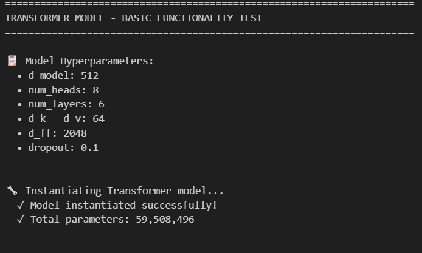
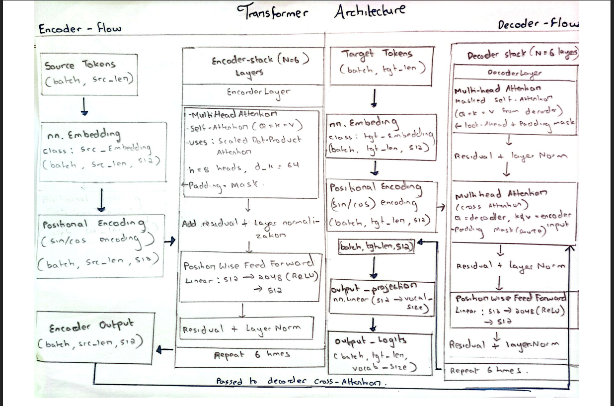
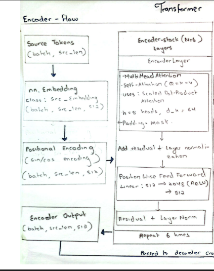
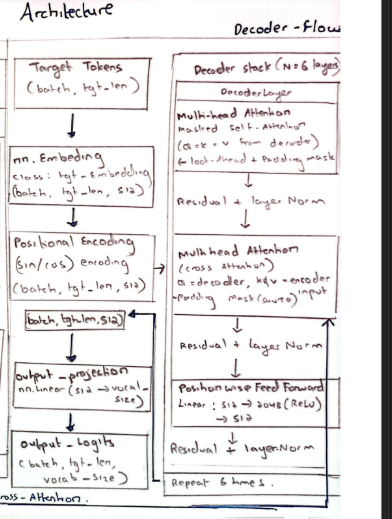

# Transformer Architecture Implementation


## What is This Project?

This is my implementation of the Transformer architecture from the research paper "Attention Is All You Need" by Vaswani et al. (2017). I built it completely from scratch using PyTorch to understand how transformers work at a deep level.

The transformer is a neural network architecture that uses attention mechanisms instead of recurrence. It's the foundation for modern language models like GPT and BERT.

---

## My Implementation

I implemented all the core components as separate Python classes. Here's what each part does:

### 1. ScaledDotProductAttention

This is the basic attention mechanism that calculates how much each word should "pay attention" to other words.

**My Code:**
```python
class ScaledDotProductAttention(nn.Module):
    def forward(self, Q, K, V, mask=None):
        d_k = Q.size(-1)
        
        # Calculate attention scores
        scores = torch.matmul(Q, K.transpose(-2, -1)) / math.sqrt(d_k)
        
        # Apply mask to ignore padding tokens
        if mask is not None:
            scores = scores.masked_fill(mask == False, -1e9)
        
        # Get attention weights using softmax
        attention_weights = self.softmax(scores)
        
        # Apply attention to values
        output = torch.matmul(attention_weights, V)
        return output, attention_weights
```

**What it does:**
- Takes Query (Q), Key (K), and Value (V) as inputs
- Computes similarity scores between Q and K
- Divides by √d_k to prevent large values
- Applies softmax to get probabilities
- Uses these probabilities to weight the Values

### 2. MultiHeadAttention

Instead of doing attention once, this splits the input into 8 "heads" and does attention in parallel. This lets the model look at different aspects of the data.

**My Code:**
```python
class MultiHeadAttention(nn.Module):
    def __init__(self, d_model, num_heads):
        super(MultiHeadAttention, self).__init__()
        self.d_model = d_model
        self.num_heads = num_heads
        self.d_k = d_model // num_heads  # 512 / 8 = 64
        
        # Linear layers for Q, K, V projections
        self.W_q = nn.Linear(d_model, d_model)
        self.W_k = nn.Linear(d_model, d_model)
        self.W_v = nn.Linear(d_model, d_model)
        
        self.attention = ScaledDotProductAttention()
        self.W_o = nn.Linear(d_model, d_model)
    
    def forward(self, Q, K, V, mask=None):
        batch_size = Q.size(0)
        
        # Project and split into multiple heads
        Q = self.W_q(Q).view(batch_size, -1, self.num_heads, self.d_k).transpose(1, 2)
        K = self.W_k(K).view(batch_size, -1, self.num_heads, self.d_k).transpose(1, 2)
        V = self.W_v(V).view(batch_size, -1, self.num_heads, self.d_k).transpose(1, 2)
        
        # Apply attention on each head
        attention_output, _ = self.attention(Q, K, V, mask)
        
        # Concatenate heads and apply final projection
        attention_output = attention_output.transpose(1, 2).contiguous().view(
            batch_size, -1, self.d_model
        )
        output = self.W_o(attention_output)
        return output
```

**What it does:**
- Splits 512 dimensions into 8 heads of 64 dimensions each
- Does attention separately for each head
- Concatenates all head outputs back together
- Applies a final linear layer

### 3. PositionWiseFeedForward

A simple two-layer neural network applied to each position.

**My Code:**
```python
class PositionWiseFeedForward(nn.Module):
    def __init__(self, d_model, d_ff):
        super(PositionWiseFeedForward, self).__init__()
        self.linear1 = nn.Linear(d_model, d_ff)    # 512 -> 2048
        self.relu = nn.ReLU()
        self.linear2 = nn.Linear(d_ff, d_model)    # 2048 -> 512
    
    def forward(self, x):
        return self.linear2(self.relu(self.linear1(x)))
```

**What it does:**
- Expands dimensions from 512 to 2048
- Applies ReLU activation
- Compresses back to 512 dimensions

### 4. PositionalEncoding

Since transformers don't process sequences in order like RNNs, we need to add position information manually.

**My Code:**
```python
class PositionalEncoding(nn.Module):
    def __init__(self, d_model, max_len=5000):
        super(PositionalEncoding, self).__init__()
        
        pe = torch.zeros(max_len, d_model)
        position = torch.arange(0, max_len, dtype=torch.float).unsqueeze(1)
        div_term = torch.exp(torch.arange(0, d_model, 2).float() * 
                            (-math.log(10000.0) / d_model))
        
        # Use sine for even indices, cosine for odd indices
        pe[:, 0::2] = torch.sin(position * div_term)
        pe[:, 1::2] = torch.cos(position * div_term)
        
        self.register_buffer('pe', pe.unsqueeze(0))
    
    def forward(self, x):
        return x + self.pe[:, :x.size(1), :]
```

**What it does:**
- Creates fixed position encodings using sine and cosine functions
- Adds these encodings to the input embeddings
- Helps the model understand word order

### 5. EncoderLayer

One complete encoder block that processes the input sequence.

**My Code:**
```python
class EncoderLayer(nn.Module):
    def __init__(self, d_model, num_heads, d_ff, dropout):
        super(EncoderLayer, self).__init__()
        self.self_attention = MultiHeadAttention(d_model, num_heads)
        self.feed_forward = PositionWiseFeedForward(d_model, d_ff)
        self.norm1 = nn.LayerNorm(d_model)
        self.norm2 = nn.LayerNorm(d_model)
        self.dropout = nn.Dropout(dropout)
    
    def forward(self, x, mask=None):
        # Self-attention with residual connection
        attention_output = self.self_attention(x, x, x, mask)
        x = self.norm1(x + self.dropout(attention_output))
        
        # Feed-forward with residual connection
        ff_output = self.feed_forward(x)
        x = self.norm2(x + self.dropout(ff_output))
        return x
```

**What it does:**
- Applies multi-head self-attention
- Adds the input back (residual connection)
- Normalizes the result
- Applies feed-forward network
- Another residual connection and normalization

### 6. DecoderLayer

One complete decoder block that generates the output sequence.

**My Code:**
```python
class DecoderLayer(nn.Module):
    def __init__(self, d_model, num_heads, d_ff, dropout):
        super(DecoderLayer, self).__init__()
        self.self_attention = MultiHeadAttention(d_model, num_heads)
        self.cross_attention = MultiHeadAttention(d_model, num_heads)
        self.feed_forward = PositionWiseFeedForward(d_model, d_ff)
        self.norm1 = nn.LayerNorm(d_model)
        self.norm2 = nn.LayerNorm(d_model)
        self.norm3 = nn.LayerNorm(d_model)
        self.dropout = nn.Dropout(dropout)
    
    def forward(self, x, encoder_output, src_mask=None, tgt_mask=None):
        # Masked self-attention
        self_attn = self.self_attention(x, x, x, tgt_mask)
        x = self.norm1(x + self.dropout(self_attn))
        
        # Cross-attention to encoder output
        cross_attn = self.cross_attention(x, encoder_output, encoder_output, src_mask)
        x = self.norm2(x + self.dropout(cross_attn))
        
        # Feed-forward
        ff_output = self.feed_forward(x)
        x = self.norm3(x + self.dropout(ff_output))
        return x
```

**What it does:**
- First does self-attention on decoder's own output (with masking to prevent looking ahead)
- Then does cross-attention with encoder's output
- Finally applies feed-forward network
- Has three sets of residual connections and normalizations

### 7. Complete Transformer Model

This puts everything together - the full model with 6 encoder layers and 6 decoder layers.

**My Code:**
```python
class Transformer(nn.Module):
    def __init__(self, src_vocab_size, tgt_vocab_size, d_model=512, num_heads=8, 
                 num_layers=6, d_ff=2048, dropout=0.1, max_len=5000):
        super(Transformer, self).__init__()
        
        self.d_model = d_model
        
        # Embeddings
        self.src_embedding = nn.Embedding(src_vocab_size, d_model)
        self.tgt_embedding = nn.Embedding(tgt_vocab_size, d_model)
        
        # Positional encoding
        self.positional_encoding = PositionalEncoding(d_model, max_len)
        
        # Stack 6 encoder layers
        self.encoder_layers = nn.ModuleList([
            EncoderLayer(d_model, num_heads, d_ff, dropout) 
            for _ in range(num_layers)
        ])
        
        # Stack 6 decoder layers
        self.decoder_layers = nn.ModuleList([
            DecoderLayer(d_model, num_heads, d_ff, dropout) 
            for _ in range(num_layers)
        ])
        
        self.dropout = nn.Dropout(dropout)
        self.output_projection = nn.Linear(d_model, tgt_vocab_size)
    
    def forward(self, src, tgt, src_mask=None, tgt_mask=None):
        # Encode source
        src_embedded = self.src_embedding(src) * math.sqrt(self.d_model)
        src_embedded = self.positional_encoding(src_embedded)
        encoder_output = self.dropout(src_embedded)
        
        for encoder_layer in self.encoder_layers:
            encoder_output = encoder_layer(encoder_output, src_mask)
        
        # Decode target
        tgt_embedded = self.tgt_embedding(tgt) * math.sqrt(self.d_model)
        tgt_embedded = self.positional_encoding(tgt_embedded)
        decoder_output = self.dropout(tgt_embedded)
        
        for decoder_layer in self.decoder_layers:
            decoder_output = decoder_layer(decoder_output, encoder_output, 
                                          src_mask, tgt_mask)
        
        # Project to vocabulary
        output = self.output_projection(decoder_output)
        return output
```

**What it does:**
- Converts source tokens to embeddings and adds position info
- Passes through 6 encoder layers
- Converts target tokens to embeddings and adds position info
- Passes through 6 decoder layers (using encoder output)
- Projects final output to vocabulary size for predictions

### Hyperparameters I Used



Following the paper's Base Model configuration:
- **d_model = 512**: Size of embeddings
- **N = 6**: Number of layers in encoder and decoder
- **h = 8**: Number of attention heads
- **d_k = 64**: Dimensions per head (512/8)
- **d_ff = 2048**: Hidden layer size in feed-forward network
- **dropout = 0.1**: Dropout rate

## Architecture Diagram



I created a flowchart diagram (`transformer_architecture_diagram.png`) that shows exactly how data flows through my implementation.

### What the Diagram Shows

**Two-Column Layout:**
- **Left side = ENCODER**: Shows how source input flows from tokens → embedding → positional encoding → 6 encoder layers → encoder output
- **Right side = DECODER**: Shows how target input flows from tokens → embedding → positional encoding → 6 decoder layers


#### Encoder Flow (Left Side)




**Purpose** : Processes the source input sequence and creates a contextualized representation.
Key Steps:

**Input Processing**:

- Source tokens (batch, src_len) → Embedding layer → (batch, src_len, 512)
- Positional Encoding added using sin/cos functions to capture sequence order

**Encoder Stack (N=6 Layers)** :

1. **Multi-Head Attention**:

-  Self-attention where Q=K=V (all from encoder input)
8 heads, d_k=64 per head
- Uses Scaled Dot-Product Attention with padding mask

2. **Add & Norm** : Residual connection + Layer Normalization


3. **Position-Wise Feed-Forward** :

- Linear: 512 → 2048 (ReLU) → 512


4. **Add & Norm** : Another residual connection + normalization
This pattern repeats 6 times


**Encoder Output** :

- Final shape: (batch, src_len, 512)
- Passed to decoder's cross-attention layer


#### Decoder Flow (Right Side) 



**Purpose** : Generates the target output sequence using encoder output and previously generated tokens.

**Key Steps** :

**Input Processing** :

- Target tokens (batch, tgt_len) → Embedding layer → (batch, tgt_len, 512)
- Positional Encoding added (same sin/cos method)


**Decoder Stack (N=6 Layers)** :

1. **Masked Multi-Head Self-Attention**:

- Q=K=V from decoder input
- Uses look-ahead mask + padding mask
- Prevents attending to future tokens


2. **Add & Norm**

3. **Multi-Head Cross-Attention** :

- Q from decoder, K&V from encoder output
- This is where encoder and decoder connect
- Uses padding mask (source)


4. **Add & Norm** 

5. **Position-Wise Feed-Forward** :

- Linear: 512 → 2048 (ReLU) → 512

6. **Add & Norm** 

**This pattern repeats 6 times**


**Output Generation**:


- Decoder output: (batch, tgt_len, 512)
- Output projection: Linear(512 → vocab_size)
- Final logits: (batch, tgt_len, vocab_size)