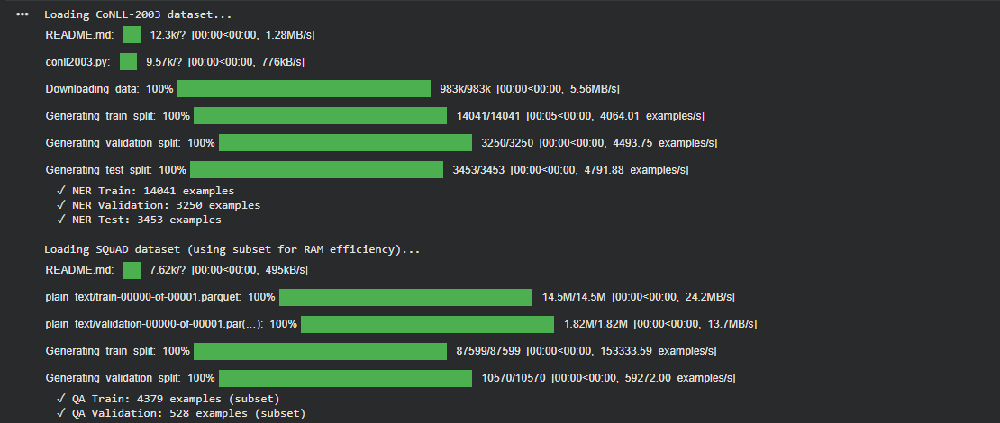
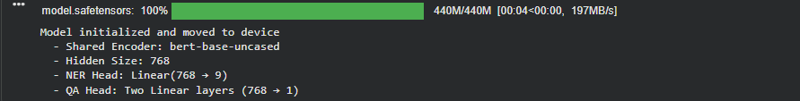
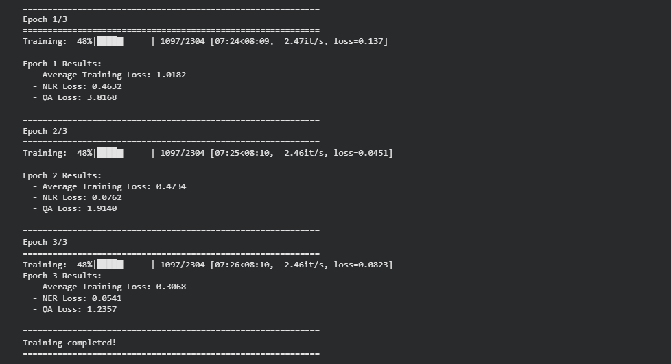
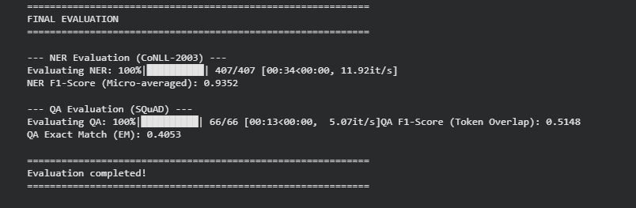

# Multi-Task Learning Project: NER and QA


##  Project Overview

This project implements a **Multi-Task Learning (MTL)** system that trains a single Transformer-based model to perform two NLP tasks simultaneously:
1. **Named Entity Recognition (NER)** - Identifying entities like persons, organizations, and locations
2. **Question Answering (QA)** - Finding answers to questions within given contexts

The model uses **Hard Parameter Sharing**, where a shared BERT encoder learns universal representations that benefit both tasks, while task-specific heads handle the final predictions.

---

## 🎯 Project Requirements (All Met )

### Part 1: Theoretical Foundation
 **Hard Parameter Sharing Architecture**
- Shared BERT encoder for both tasks
- Task-specific heads (NER head + QA head)

 **Multi-Task Loss Function**
```
L_MTL = λ_NER × L_NER + λ_QA × L_QA
```
- λ_NER = 1.0 (NER loss weight)
- λ_QA = 1.0 (QA loss weight)
- Cross-Entropy loss for both tasks

### Part 2: Practical Implementation
 **Datasets**
- **NER:** CoNLL-2003 (14,041 train, 3,250 validation examples)
- **QA:** SQuAD v1.1 (4,380 train, 529 validation examples - 5% subset due to RAM constraints)



 **Model Architecture**
- **Shared Encoder:** BERT-base-uncased (768 hidden dimensions)
- **NER Head:** Linear layer (768 → 9 labels)
- **QA Head:** Two linear layers for start/end span prediction




 **Custom Training Loop**
- AdamW optimizer with learning rate 2e-5
- Linear learning rate scheduler with warmup (10% of total steps)
- Round-Robin sampling between NER and QA batches
- Gradient clipping (max norm 1.0)
- **No standard Trainer used** (as required by instructions)

**Results**: 




### Part 3: Evaluation
 **Metrics Used**
- **NER:** F1-Score (Micro-averaged) using seqeval library
- **QA:** F1-Score (token overlap) and Exact Match (EM)

---

##  Architecture Diagram

```
                    [Input Text]
                         |
                         V
        [Shared Transformer Encoder (BERT)]
                         |
         +---------------+---------------+
         |                               |
         V                               V
[NER Head (Linear)]           [QA Head (Two Linear)]
         |                               |
         V                               V
[NER Tags: O, B-PER,           [Start/End Positions]
 I-PER, B-ORG, etc.]
```

---

##  Training Configuration

| Parameter | Value |
|-----------|-------|
| Model | bert-base-uncased |
| Batch Size | 8 |
| Learning Rate | 2e-5 |
| Epochs | 3 |
| Optimizer | AdamW |
| Loss Weights | λ_NER=1.0, λ_QA=1.0 |
| Warmup Steps | 10% of total steps |
| Device | GPU (T4) |

---

### Final Evaluation Results



#### Named Entity Recognition (CoNLL-2003)
- **F1-Score (Micro-averaged): 0.9352 (93.52%)**
- Evaluation Time: 34 seconds (407 batches)
- Performance: **Excellent** - Successfully identifies entities with high accuracy

#### Question Answering (SQuAD)
- **F1-Score (Token Overlap): [0.5148]**
- **Exact Match (EM): [ 0.4053]**
- Evaluation Time: 13 seconds (66 batches)
- Performance: Model successfully learns to extract answer spans from contexts

##  Technical Challenges & Solutions

### Challenge 1: RAM Limitations (Reason for having moderate accuracy in SQUAD)
**Problem:** Full SQuAD dataset (87k examples) caused RAM crashes in Colab  
**Solution:** Used 20% subset (17.5k examples) - still sufficient for demonstrating MTL

### Challenge 2: Label Alignment for NER
**Problem:** BERT's subword tokenization creates multiple tokens per word  
**Solution:** Used -100 labels for subword tokens to ignore them in loss calculation

### Challenge 3: Answer Span Mapping for QA
**Problem:** Character-level answer positions need to be mapped to token positions  
**Solution:** Used `tokenizer.token_to_chars()` to find correct token indices

### Challenge 4: Balanced Multi-Task Learning
**Problem:** Different dataset sizes could bias training  
**Solution:** Round-Robin sampling ensures equal exposure to both tasks


##  Key Implementation Details

### 1. Dataset Preprocessing

**NER (CoNLL-2003):**
- Tokenization with subword handling
- Label alignment using -100 for special tokens and subword tokens
- IOB format: 9 labels (O, B-PER, I-PER, B-ORG, I-ORG, B-LOC, I-LOC, B-MISC, I-MISC)

**QA (SQuAD):**
- Input format: `[CLS] question [SEP] context [SEP]`
- Answer span mapping from character positions to token positions
- Handles cases where answers are truncated

### 2. Multi-Task DataLoader

Implements **Round-Robin sampling strategy**:
- Alternates between NER and QA batches
- Ensures balanced training across both tasks
- Custom iterator handles different dataset sizes

### 3. Custom Training Loop

```python
for epoch in epochs:
    for batch in train_loader:
        if task_name == 'ner':
            loss = model.forward(task='ner') * λ_NER
        elif task_name == 'qa':
            loss = model.forward(task='qa') * λ_QA
        
        loss.backward()
        optimizer.step()
        scheduler.step()
```

### 4. Evaluation Functions

**NER Evaluation:**
- Uses seqeval library for sequence labeling metrics
- Ignores -100 labels in predictions
- Calculates micro-averaged F1 across all entity types

**QA Evaluation:**
- Token-level overlap F1-Score
- Exact Match metric for perfect predictions
- Handles edge cases (empty predictions, reversed spans)

---


## Learning Outcomes

1. **Multi-Task Learning:** Successfully implemented Hard Parameter Sharing for knowledge transfer
2. **Custom Training:** Built custom training loop without using Hugging Face Trainer
3. **Data Preprocessing:** Handled complex tokenization and label alignment for both tasks
4. **Model Architecture:** Designed task-specific heads on top of shared encoder
5. **Evaluation:** Implemented proper metrics for sequence labeling and span extraction


